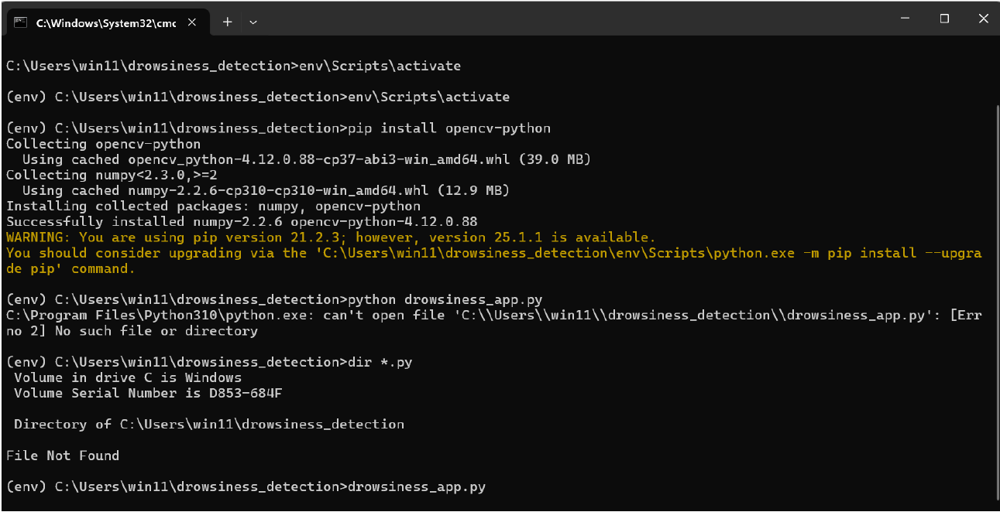
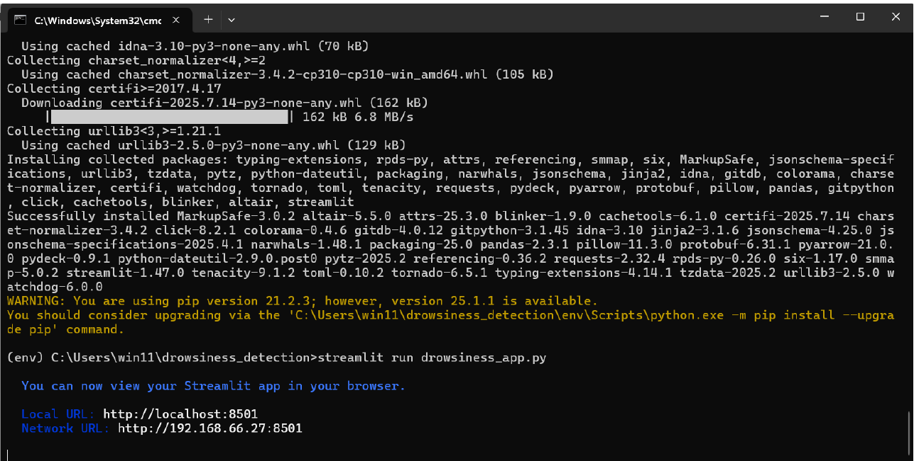
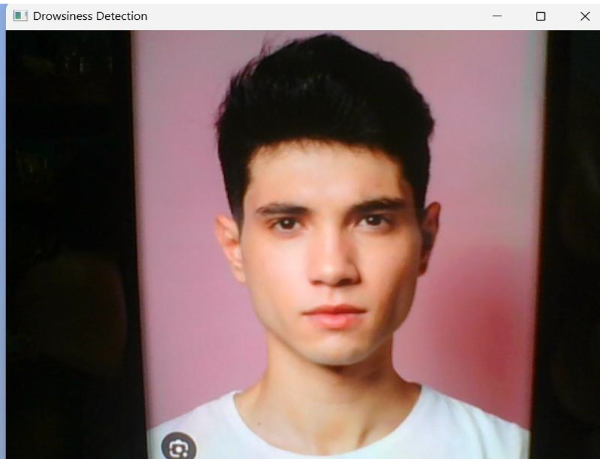
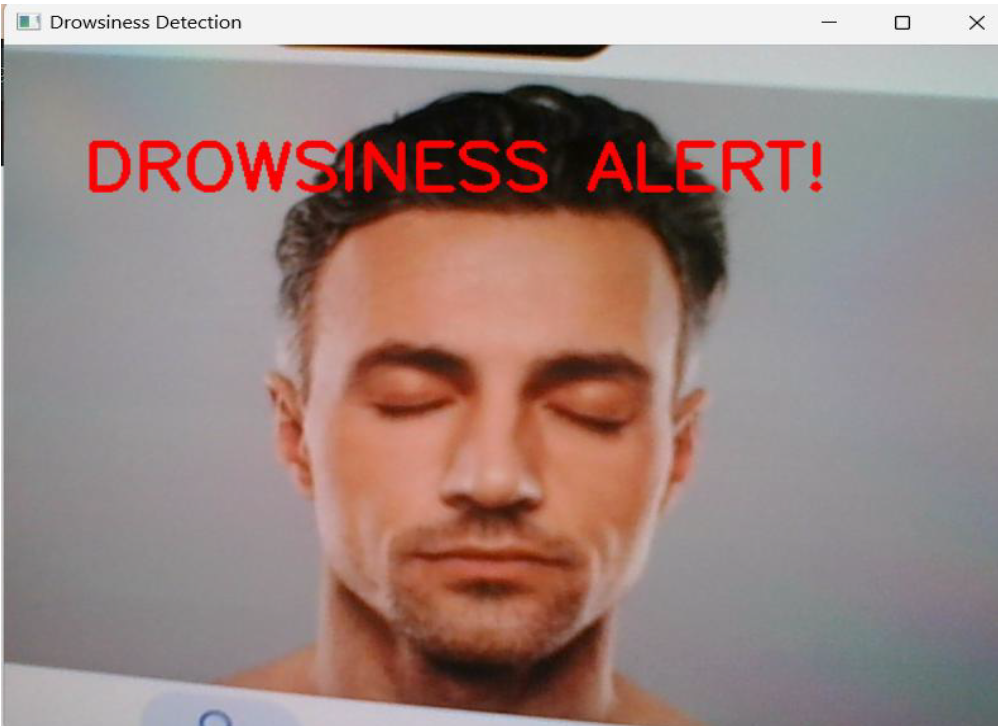

🚗 Drowsiness Detection System using OpenCV & Dlib
📌 Project Overview

This project is a real-time Drowsiness Detection System developed using Python, OpenCV, Dlib, and Streamlit.

The system monitors eye activity using a webcam and detects drowsiness by calculating the Eye Aspect Ratio (EAR) from facial landmarks.

If the eyes remain closed for a defined threshold, a visual alert ("DROWSINESS ALERT!") is triggered.

🎯 Problem Statement

Driver fatigue is one of the leading causes of road accidents.
This system helps detect early signs of drowsiness and provides a real-time alert to improve road safety.

🧠 How It Works

Webcam captures live video.

Dlib detects 68 facial landmarks.

Eye landmarks are extracted.

Eye Aspect Ratio (EAR) is calculated:

𝐸
𝐴
𝑅
=
(
∣
∣
𝑝
2
−
𝑝
6
∣
∣
+
∣
∣
𝑝
3
−
𝑝
5
∣
∣
)
/
(
2
∣
∣
𝑝
1
−
𝑝
4
∣
∣
)
EAR=(∣∣p2−p6∣∣+∣∣p3−p5∣∣)/(2∣∣p1−p4∣∣)

If EAR < 0.25 for consecutive frames → Alert triggered.

🛠 Technologies Used

Python 3.10

OpenCV

Dlib

Haar Cascade

Streamlit

Scipy

Numpy

📂 Project Structure
drowsiness-detection-system/
│── app.py
│── requirements.txt
│── haarcascade_eye.xml
│── models/
│── screenshots/
▶️ Installation & Setup
Step 1: Clone Repository
git clone https://github.com/your-username/drowsiness-detection-system.git
cd drowsiness-detection-system
Step 2: Create Virtual Environment
python -m venv env
env\Scripts\activate
Step 3: Install Dependencies
pip install -r requirements.txt
Step 4: Download Shape Predictor

Download from:
http://dlib.net/files/shape_predictor_68_face_landmarks.dat.bz2

Extract and place inside:

models/
▶️ Run the Application

If using OpenCV window:

python app.py

If using Streamlit:

streamlit run app.py

## 📸 Screenshots

### 🖥 Terminal Running the Script

### 🚀 Streamlit Application Running

### 👀 Open Eyes Detection

### ⚠️ Drowsiness Alert Triggered

🚀 Future Improvements

Deep learning-based eye state detection (CNN)

Yawn detection

Head pose estimation

IoT integration for vehicle systems

Night vision support

📚 References

OpenCV Documentation

Dlib Official Website

Streamlit Docs

Eye Aspect Ratio Research Paper

👨‍💻 Author

M Venkateshwar Rao
Data Analyst | Python Developer
